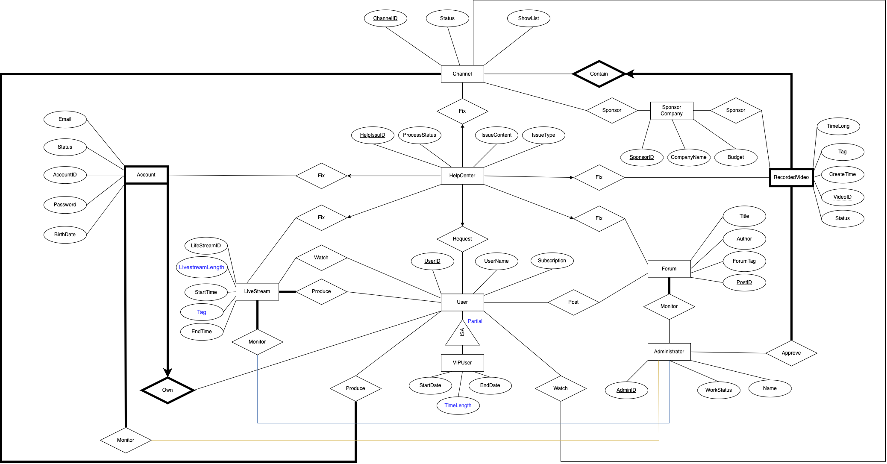

# University Video Brain

Above is the ER diagram for our final project. We only made one small changes on entity "LiveStream" where a new attribute "Tag" is added to better apply the group by operation. We want to highlight it here to make it more understandable for our coding structure.

Comment highlight:

Total Participation: User produce Channel and LiveStream, Administrator monitor Account, Forum and LiveStream, Administrator approve RecordedVideo, Channel contains RecordedVideo, User own Accounts

ISA: VIPUser ISA(partial) User

Weak Entities: Channel contains RecordedVideo, User own Accounts

Entity, attribute and relationship highlight:

In total, we have 10 entities: Account, User, VIPuser, Channel, RecordedVideo, Forum, HelpCenter, Administrator, SponsorCompany, and LiveStream.

A user is assigned a unique user id while each user is able to maintain multiple accounts. Besides, more relevant information is stored as attributes (e.g: user name, subscription, plus start date, end date, time length from VIPuser).

Channels component, each channel is created by users and consists of its unique channel id, status, show list (a list of the containing videos’ ids),

Recorded videos (for each having its unique video id, a time long, create time, status, and a tag to indicate whether this recorded video is only for VIP users).

The users can create and watch the live streams(for each having LiveStreamLength, LifeStreamID, StartTime and EndTime), and post posts on forums with various tags as well.

The help centers are responsible for accepting help requests where user can send and delete help issues.
The administrators are in charge of checking the legality and validity of accounts and recorded videos, modifing user account information and setting the status of corresponding illegal or invalid accounts or recorded videos into “blocked”.

Sponsor companies represent the sponsors of channels or recorded videos.
